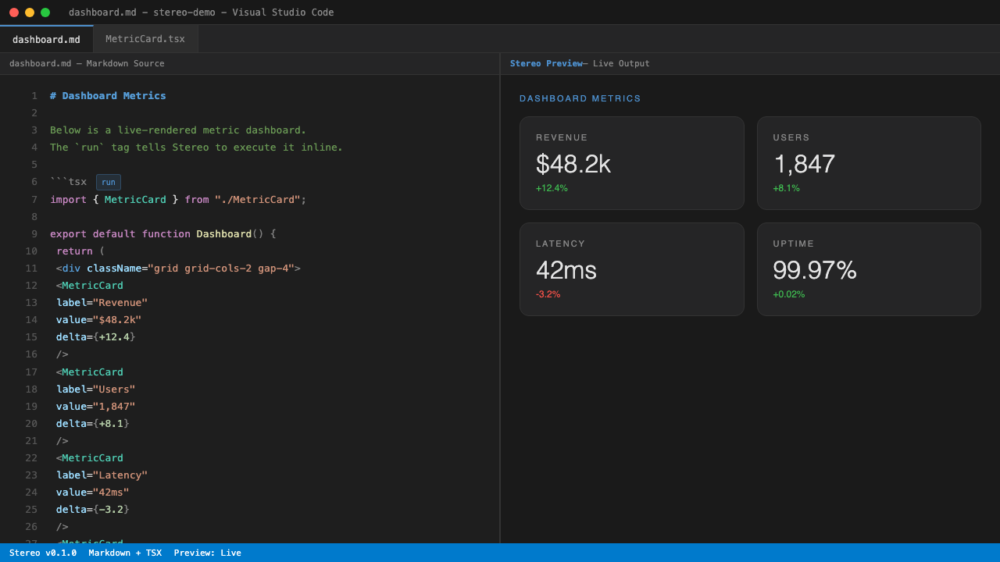

# Stereo

**Your markdown runs now.**

Stereo is a VS Code extension that turns `.md` files into executable dashboards. Write standard markdown, add `tsx run` code blocks, and watch them render inline -- metrics, charts, tables, and live-updating panels right inside your editor.

[](https://marketplace.visualstudio.com/items?itemName=leap21.stereo)
[](LICENSE)
[](https://marketplace.visualstudio.com/items?itemName=leap21.stereo)



---

## Quick Start

1. **Install** Stereo from the VS Code Marketplace (or `ext install leap21.stereo`).
2. **Create a `.md` file** with an executable code block:

   ````markdown
   # My Dashboard

   ```tsx run
   <MetricCard label="Uptime" value="99.97%" trend={+0.02} />
   ```
   ````

3. **Open the preview** with `Ctrl+Shift+M` (or `Stereo: Open Preview` from the command palette).

That's it. Your markdown is now a live dashboard.

---

## Built-in Components

Stereo ships with a set of ready-to-use components available in every `run` block:

| Component | Description |
|-----------|-------------|
| **MetricCard** | Single-value KPI card with label, value, and optional trend indicator. |
| **DashGrid** | Responsive grid layout that arranges child components into columns. |
| **Sparkline** | Inline SVG sparkline chart from an array of numbers. |
| **StatusTable** | Tabular display for status rows with name, value, and state columns. |

---

## Features

- **Executable code blocks** -- add `run` after the language tag to make any fenced block live.
- **React rendering** -- `tsx run` blocks render as full React components with hooks support.
- **Auto-refresh** -- set `refresh=5s` on a block to re-execute it on an interval.
- **Environment variable references** -- use `{{env.API_KEY}}` to pull values from your workspace environment.
- **VM sandboxed execution** -- code runs in an isolated VM context, not in the extension host.
- **Dark theme** -- OKLCH-based dark UI that matches VS Code's native look.
- **Zero config** -- no setup files, no build step. Just write markdown.

---

## How It Works

Stereo registers a `CustomTextEditorProvider` for `.md` files. When you open the Stereo preview:

1. The **markdown parser** scans for fenced code blocks tagged with `run` and extracts them along with any options (`refresh=`, `height=`, etc.).
2. Each executable block is evaluated in a **Node.js VM sandbox** with React and the built-in component library pre-injected.
3. The result is **server-side rendered** to HTML and sent to a VS Code webview panel.
4. Blocks with `refresh=` intervals are re-executed automatically, and the webview patches in the updated output.

The architecture keeps the extension host lightweight -- parsing and rendering happen in isolated contexts, and the webview receives only serialized HTML.

---

## Roadmap

- **Rust sidecar** for secret injection and secure environment variable resolution.
- **Team sync** -- share live dashboards across a team via workspace state.
- **Component registry** -- install community components from a central registry.
- **Shell and Python blocks** -- execute non-JS languages via sidecar processes.

---

## Contributing

Contributions are welcome. The source is hosted on GitLab:

[gitlab.leap21llc.com/leap21/stereo](https://gitlab.leap21llc.com/leap21/stereo)

Open an issue or submit a merge request. Please follow the existing code style (2-space indent, semicolons, double quotes).

---

## License

[MIT](LICENSE)
